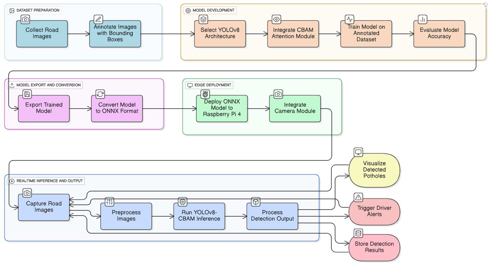

# Attention-Driven YOLOv8 Multi-Sensor Architecture for Edge-Enabled Road Pothole Detection

## Abstract
This repository contains the implementation artifacts for the research paper "Attention-Driven YOLOv8 Multi-Sensor Architecture for Edge-Enabled Road Pothole Detection". The proposed system integrates a lightweight object detection model (YOLOv8n) with a Convolutional Block Attention Module (CBAM) to enhance feature extraction capabilities in varying illumination and road conditions. The system is deployed on an embedded edge device, coupled with ultrasonic and vibration sensors for multi-modal verification.

## System Architecture
The architecture constitutes three primary subsystems:
1.  **Vision Module**: Executes real-time inference on video frames to identify pavement distress.
2.  **Sensor Interface**: Aggregates telemetry from ultrasonic depth sensors and vibration modules to corroborate visual detections.
3.  **Cloud Backend**: Receives verified detection events for geospatial mapping and long-term storage.


## Repository Structure
The codebase is organized into modular components reflecting the system's logical design:

### 1. Device Firmware (`Code/Device/`)
-   `main.py`: Central orchestrator managing the event loop and subsystem integration.
-   `pothole_detector.py`: Encapsulates the computer vision pipeline and model inference logic.
-   `sensor_manager.py`: Interface for hardware sensor data acquisition and signal processing.
-   `notification_system.py`: Manages local user alerts (Audio/Visual) and status indication.
-   `backend_client.py`: Handles reliable, asynchronous data transmission to the cloud server.
-   `config.py`: Centralized configuration management for tunable parameters.

### 2. Model Development (`Code/Model/`)
-   `yolov8n_cbam_pothole.ipynb`: Workflow for training the attention-enhanced YOLOv8 model, including dataset preparation, architecture modification, and performance evaluation.

## Methodology
The core detection algorithm modifies the standard CSP-Darknet53 backbone of YOLOv8 by injecting CBAM blocks at critical feature extraction stages. This allows the network to focus on relevant spatial and channel-wise features, effectively suppressing background noise common in road surface imagery.



## Evaluation
The model was evaluated on a custom dataset of asphalt road images. Performance metrics indicate an improvement in Mean Average Precision (mAP) compared to the baseline YOLOv8n model, particularly in detecting small-scale defects.

## Deployment
deploy the system to the target edge hardware:
1.  Configure the `config.py` with appropriate sensor pin mappings and backend credentials.
2.  Ensure the trained model weights (`yolov8n_cbam_pothole.pt`) are placed in the `models/` directory.
3.  Execute the main entry point:
    ```bash
    python3 Code/Device/main.py
    ```

## License
Research use only. All rights reserved.


