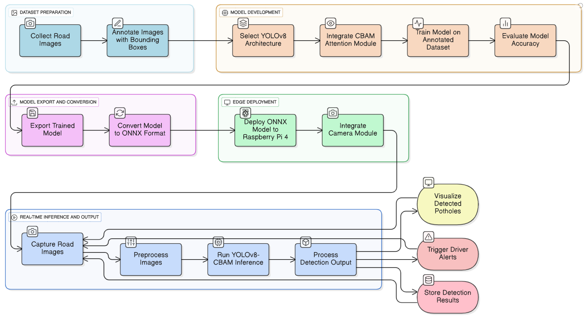
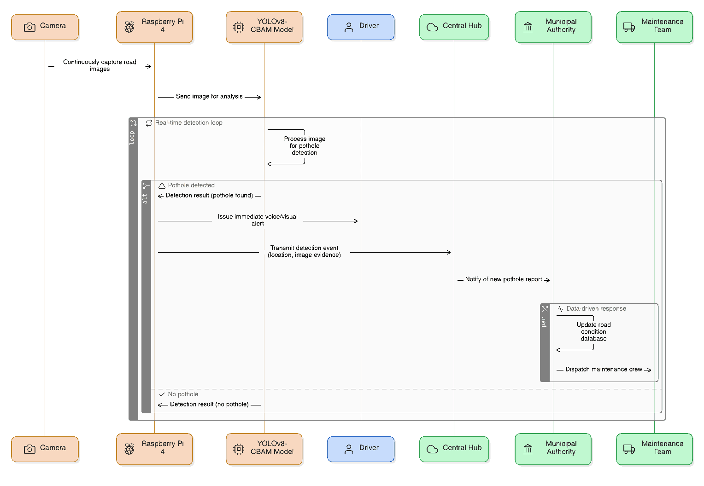
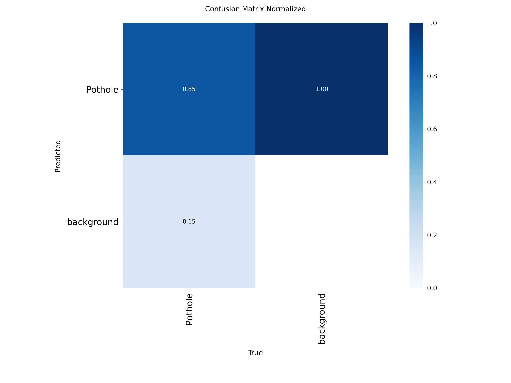
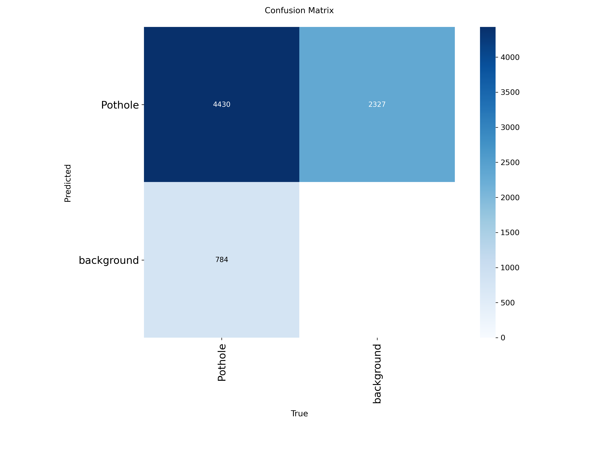
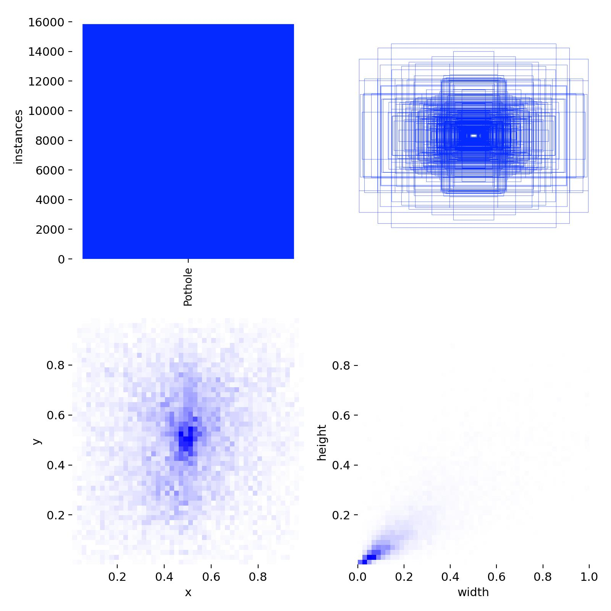
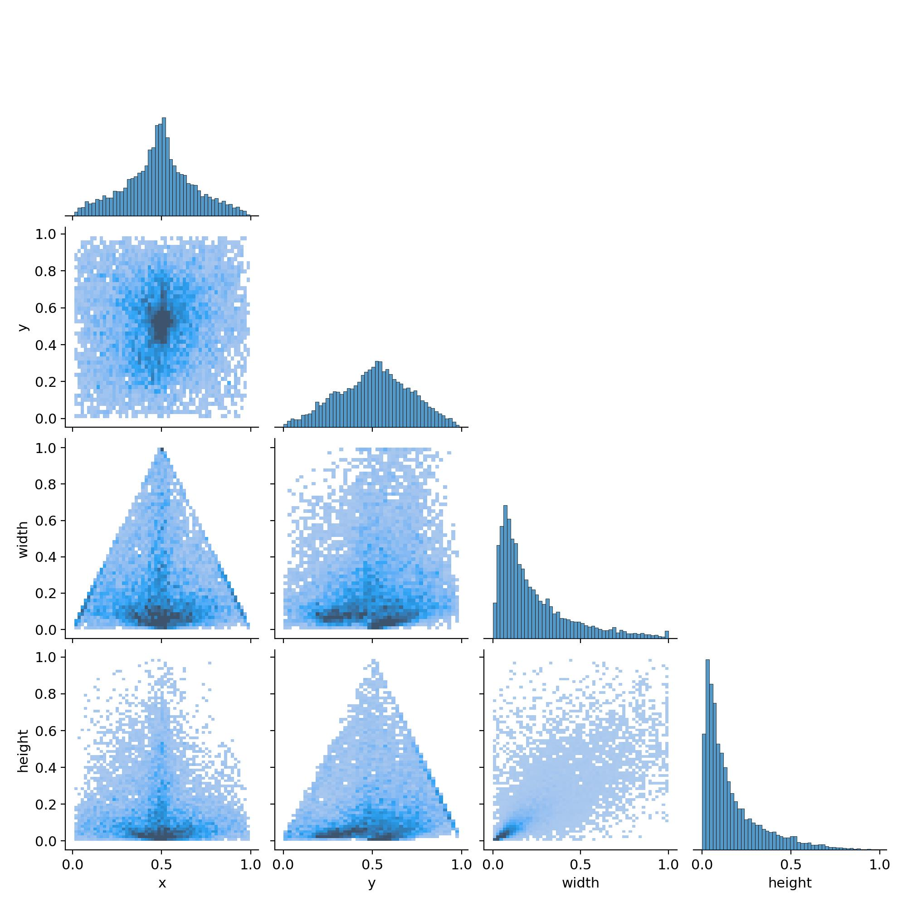
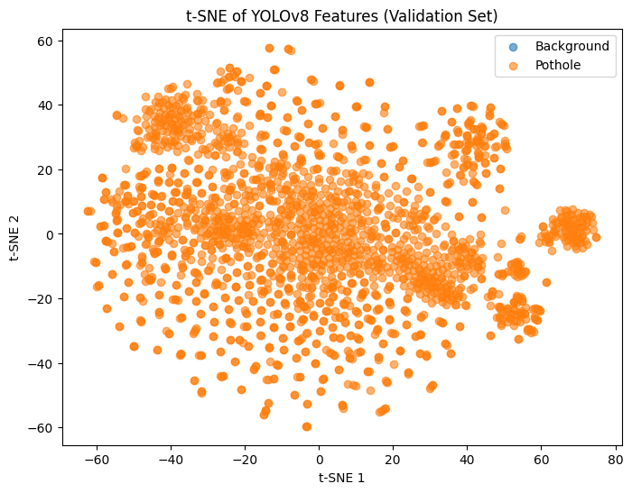
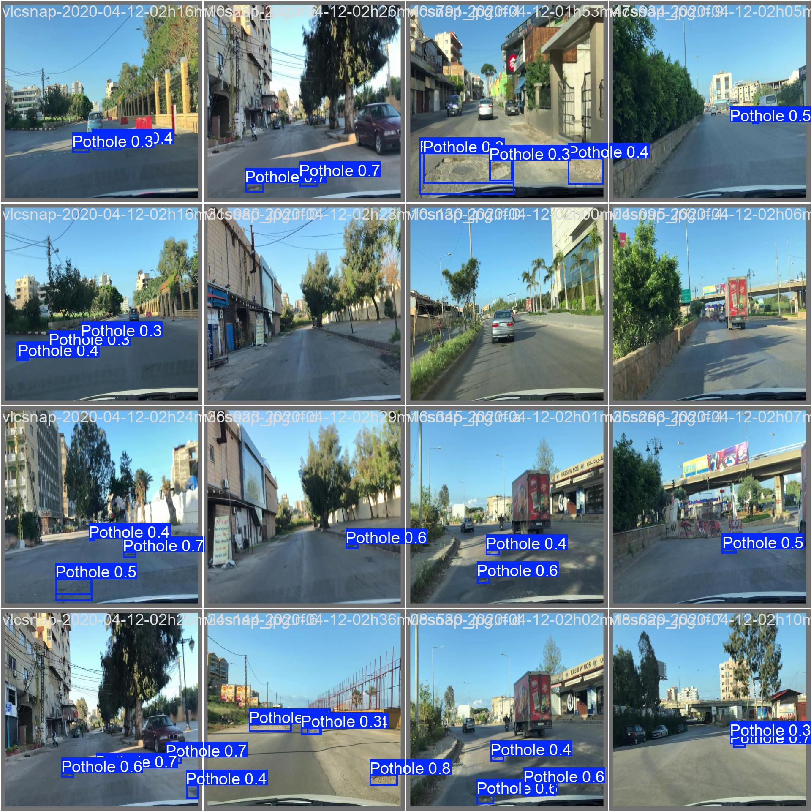
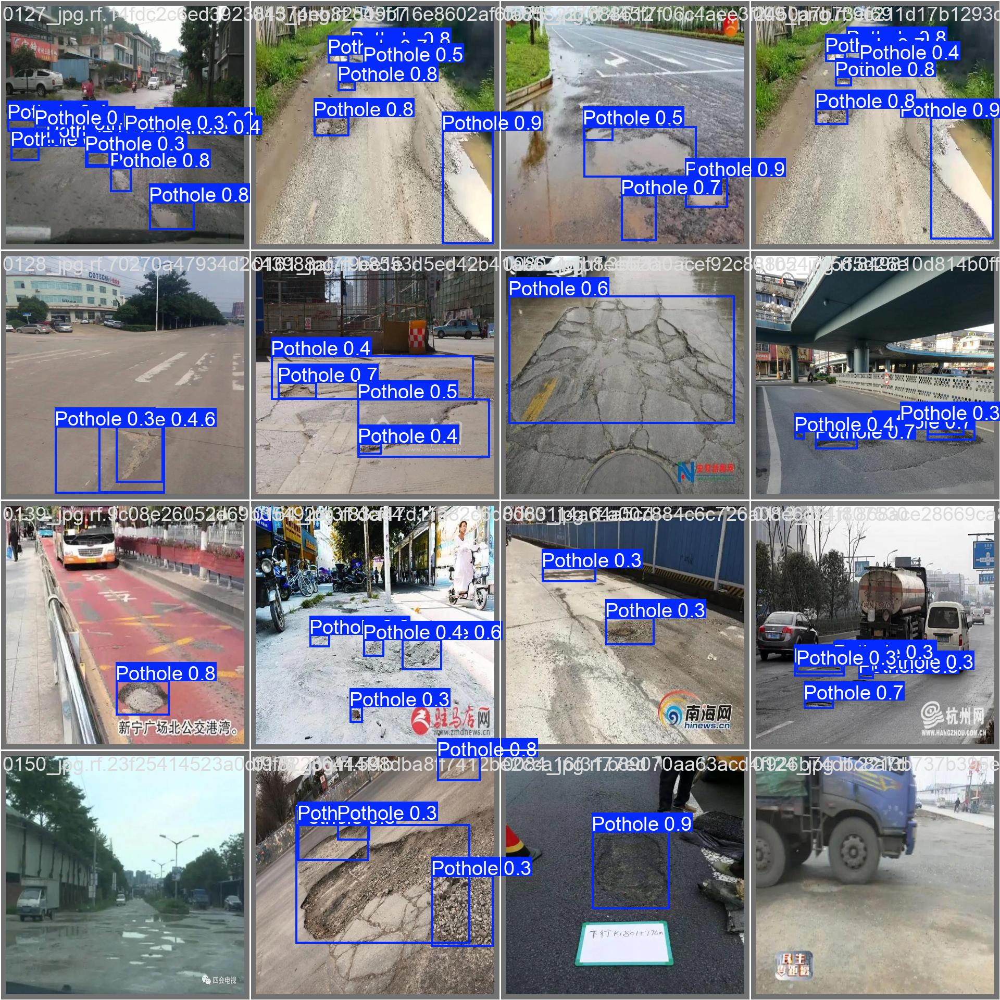
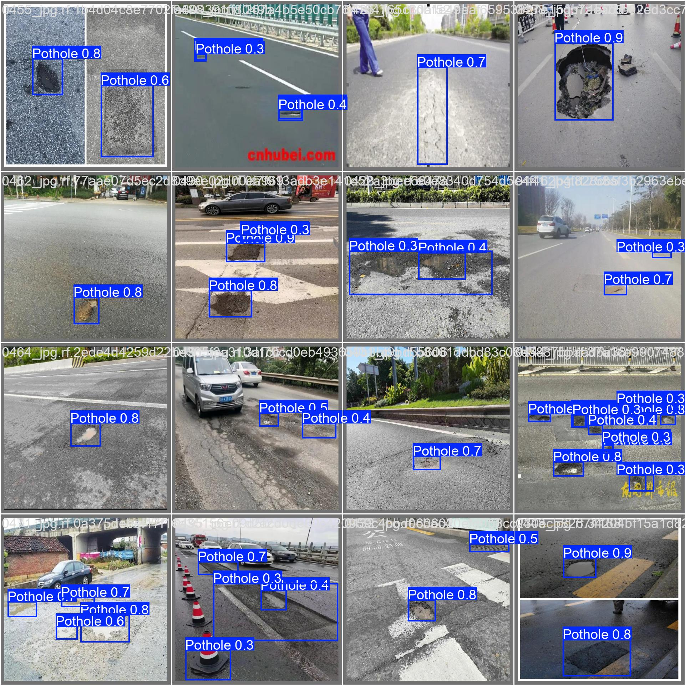

## Pothole Detection (YOLOv8) — Offline Setup & Usage

This project contains Jupyter notebooks for pothole detection using YOLOv8, including `final-pothole-program-yolo8n.ipynb` and `yolov8n_cbam_pothole.ipynb`. Follow the steps below to run fully offline.

### 1) Environment
- **OS**: Linux (tested)
- **Python**: 3.9–3.11 recommended

Create and activate a virtual environment:

```bash
python3 -m venv .venv
source .venv/bin/activate
python -m pip install -U pip wheel setuptools
```

### 2) Dependencies

If you have internet access once (preferred):

```bash
pip install jupyter ultralytics opencv-python numpy matplotlib

# Optional: PyTorch with CUDA (choose the right URL for your CUDA)
# See https://pytorch.org/get-started/locally/
# Example CPU-only:
pip install torch torchvision torchaudio --index-url https://download.pytorch.org/whl/cpu
```

Fully offline installation (no internet on the target machine):
1. On a machine with internet, pre-download wheels into a folder (e.g. `wheelhouse/`):
   ```bash
   pip download -d wheelhouse jupyter ultralytics opencv-python numpy matplotlib
   pip download -d wheelhouse torch torchvision torchaudio --index-url https://download.pytorch.org/whl/cpu
   ```
2. Copy `wheelhouse/` to the offline machine alongside this project.
3. Install from local wheels offline:
   ```bash
   pip install --no-index --find-links wheelhouse -r <(printf "jupyter\nultralytics\nopencv-python\nnumpy\nmatplotlib\ntorch\ntorchvision\ntorchaudio\n")
   ```

### 3) Weights and Data (offline)
- Download a YOLOv8 model file beforehand (e.g. `yolov8n.pt`) and place it in `weights/`:
  - `weights/yolov8n.pt` (baseline YOLOv8n)
- Place your dataset locally, for example:
  - `data/images/` for input images or videos
  - `data/` for any training YAMLs or custom splits

Update notebook cells to point to these local paths if needed, e.g.:

```python
weights_path = "weights/yolov8n.pt"
source_path = "data/images"
```

### 4) Launch the Notebooks

```bash
jupyter notebook
# or
jupyter lab
```

Open one of the notebooks:
- `final-pothole-program-yolo8n.ipynb`
- `yolov8n_cbam_pothole.ipynb`

Then run the cells in order. The notebooks are prepared to run offline as long as weights and data paths are local.

### 5) Quick Inference (script-style, optional)
If you prefer running a quick offline inference without the notebook:

```bash
python - <<'PY'
from ultralytics import YOLO
import os

model = YOLO("weights/yolov8n.pt")  # local file
results = model.predict(source="data/images", save=True)  # folder, image, or video
print("Predictions saved to:", os.path.abspath("runs/detect"))
PY
```

### 6) Tips
- If CUDA is unavailable, PyTorch will fall back to CPU automatically.
- Keep everything (weights, data, wheels) inside the project directory so paths remain simple and offline-safe.
- If Ultralytics tries to check for updates, it will still run offline; ensure weights are local and code doesn’t call any remote URLs.

### 7) Visuals

#### Device setup
Images of the physical device and assembly are in `Pictures/Device/`.

<table>
  <tr>
    <td></td>
    <td></td>
  </tr>
  <tr>
    <td></td>
    <td></td>
  </tr>
  <tr>
    <td></td>
    <td></td>
  </tr>
  
</table>

#### Flowcharts
System and training flow diagrams are in `Pictures/Flowcharts/`.





#### Model results and diagnostics
Training and validation artifacts are in `Pictures/model/`.

<table>
  <tr>
    <td></td>
    <td></td>
  </tr>
  <tr>
    <td></td>
    <td></td>
  </tr>
  <tr>
    <td></td>
    <td></td>
  </tr>
  <tr>
    <td></td>
    <td></td>
  </tr>
</table>

Additional training batches and label views are available in the folder (`train_batch*.jpg`, `val_batch*_labels*.jpg`).

### 8) Minimal Requirements List (for reference)
```text
jupyter
ultralytics
opencv-python
numpy
matplotlib
torch
torchvision
torchaudio
```


